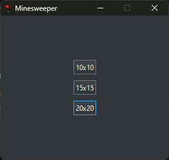

# Minesweeper

A basic Minesweeper implementation built in C++ Qt.
Hard-coded 20% tiles are mined, with 3 different game board sizes of 10x10, 15x15, and 20x20.

## Screenshot



## How to play
- Left click to open tiles
  - 3x3 area centered on the first tile clicked will always be safe
- Right click to set flags
- Middle click to restart game

## Build
### Requirements
- Qt 6.x
- CMake 3.16+
- Ninja if building with it

### Configure & Build
```bash
cmake -S . -B build -G Ninja
cmake --build build
```
